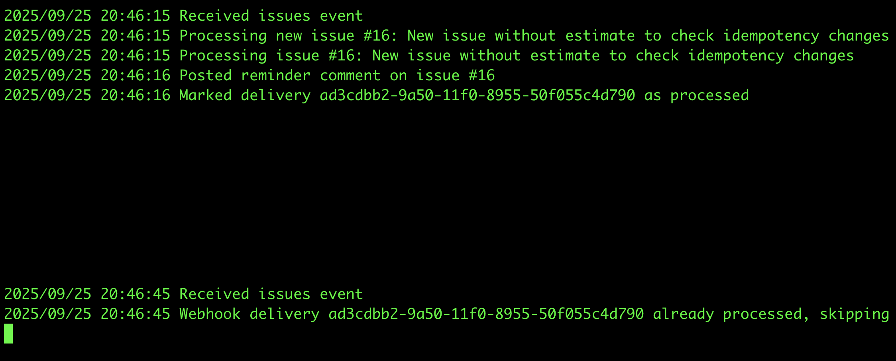
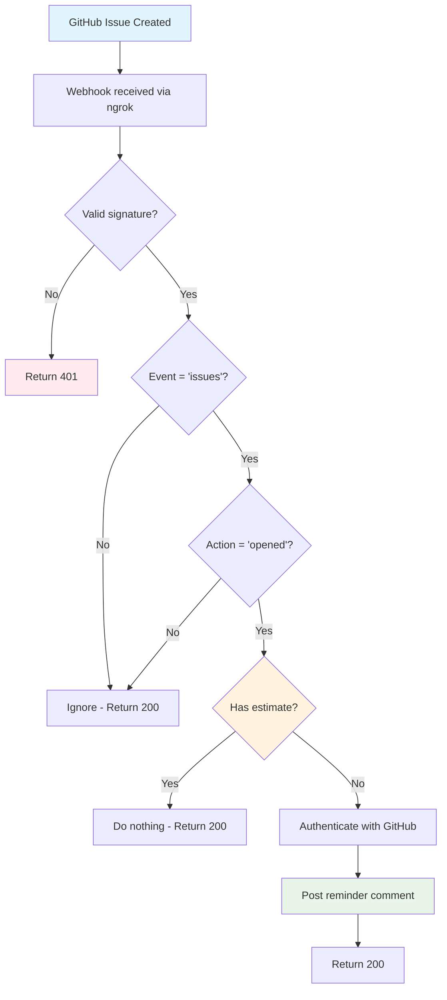

# GitHub Issue Estimate Reminder App

A GitHub app that automatically detects when a new GitHub issue is created and posts a comment to remind the issue creator to provide a time estimate if it's missing.

## Branch Information

* `main` - Current branch with refactored code following standard Go project layout
* `main-before-refactoring` - Original implementation before refactoring (same functionality, different structure)
* `main-with-improvements` - Post-deadline enhancements and optimizations (built on top of `main`)

## Improvements to be added for the app to be production ready

### **Idempotency Protection**

Since GitHub's webhook delivery is at-least-once, same event can arrive multiple times due to retries or timeouts.

**Solution**: Redis-based idempotency using GitHub's `X-GitHub-Delivery` ID



### **Not Implemented: Queue-Based Background Processing**

We might face 2 problems with the current implementation:
1. **GitHub API is down**: then we will not be able to post a comment on the issue & event will be lost
2. **Event Loss During Deployments & Server failures**:
We might solve the first issue by introducing a retry mechanism with exponential backoff, however this might lead to server resources exhaustion in case we have a lot of retries as each webhook holds a goroutine for minutes.

**Solution**: Handle event processing async using a queueing system with Exponential backoff retry logic


## Architecture

This project follows the [standard Go project layout](https://github.com/golang-standards/project-layout)

- `/cmd` - Application entry points
- `/internal` - Private application code  
- Tests use dependency injection for easy mocking and integration testing

## Prerequisites

### Option 1 - Local Go Development:

- Go 1.24
- GitHub account
- ngrok (creates secure tunnels from the public internet to your local machine)

### Option 2 - Use **Docker** isntead of Local Go Development

## Setup

### Option 1: Local Go Development

```bash
go mod init github.com/taman9333/issue-estimate-reminder
go mod tidy
```

## Step 1: Install ngrok

```bash
# macOS
brew install ngrok

# Or download from https://ngrok.com/download
```

## Step 2: Create GitHub App

1. Go to **GitHub Settings** → **Developer settings** → **GitHub Apps**
2. Click **New GitHub App**
3. Fill required fields:
   - **GitHub App name**: `issue-estimate-reminder-assessment`
   - **Homepage URL**: `https://github.com/taman9333/issue-estimate-reminder`
   - **Webhook URL**: `public URL ngrok gave to you after running ngrok command` ([update after step 4](#step-4-run-application))
   - **Webhook secret**: Generate random string (save this!)

4. **Set Permissions**:
   - Repository permissions → **Issues**: Read & write
   - Repository permissions → **Metadata**: Read

5. **Subscribe to Events**:
   - Check **Issues**

6. **Generate Private Key**:
   - Click **Generate a private key**
   - Download `.pem` file, save as `app.pem` in project root

7. **Save App ID** (found at top of GitHub App page)

## Step 3: Configure Environment

Create `.env` file:

```env
GITHUB_APP_ID=your_app_id
GITHUB_PRIVATE_KEY_PATH=./app.pem
WEBHOOK_SECRET=your_webhook_secret
PORT=8080
```

## Step 4: Run Application

### Option 1: Using Go directly:

**Terminal 1:**
```bash
go run cmd/server/main.go
```

**Terminal 2:**
```bash
ngrok http 8080
```

---

### Option 2: Using Docker

**Terminal 1:**
```bash
docker-compose up -d --build
```

**Terminal 2:**
```bash
ngrok http 8080
```

---

Copy ngrok URL and update GitHub App webhook URL to the one ngrok gave to you: `https://your-ngrok-url/webhook`

## Step 5: Install GitHub App

1. In GitHub App settings → **Install App**
2. Select issue-estimate-reminder repository
3. Grant permissions

## Step 6: Test

Create issue **without** estimate:
```
Bug in login system
Steps: 1. Go to login 2. See error
```
→ App should comment

Create issue **with** estimate:
```
Add new feature
Estimate: 3 days
```
→ App should NOT comment

## How It Works - Logic Flow

This flowchart shows the app's decision process when receiving GitHub webhooks:

